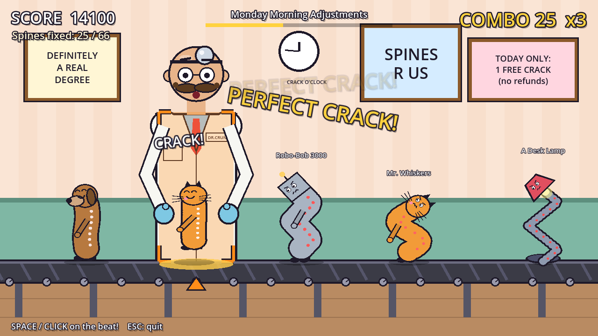

# Rhythm Chiropractor

A silly one-button rhythm game. You are **Dr. Crunch** (not a real doctor), stationed at a
conveyor belt. Crooked customers roll in (office workers, grandmas, dogs, cats, giraffes,
snakes, a banana, a desk lamp) and you crack their spines straight **on the beat**.



> This repo also holds a second, separate Godot game: **[Pool Boy](pool-boy/README.md)** in
> `pool-boy/`. Open its own `pool-boy/project.godot`. Godot ignores nested project folders,
> so the two games don't interfere.

## Running it

1. Install **Godot 4.4+** (standard build, not .NET): https://godotengine.org/download
2. Godot Project Manager → **Import** → pick this folder's `project.godot`.
3. Press **F5**.

No asset files are needed. All art is drawn in code and all audio (music + SFX) is
synthesized at startup, so the project runs straight from a fresh clone.

## Web version (phone, portrait)

`web/index.html` is a standalone JavaScript port of the same game, laid out for portrait
phones: tap anywhere to crack. It's a single file with no build step. It's written as an
HTML fragment (no `<html>`/`<head>` wrapper) because it's published as a Claude artifact,
which adds that wrapper. To host it elsewhere, wrap it in a normal HTML document with a
`<meta name="viewport" content="width=device-width, initial-scale=1">` tag. Add `#autoplay`
to the URL to watch a bot play.

The Godot project is still the main version. Treat the web build as a playable sketch
for testing the fun on a phone. Gameplay changes need to be made in both places.

## Controls

| Action | Keys |
| --- | --- |
| Crack | Space, Z, X, J, K, left mouse, gamepad A |
| Quit / back | Esc |
| Fullscreen | F11 or Alt+Enter |
| Audio offset (title screen) | `[` and `]`, in 5 ms steps |

## How it plays

- Patients ride the belt toward the glowing zone. Each chart beat = one patient.
- One-crack patients need a single hit. **Two-crack** patients (giraffe, snake, lamp) need a
  quick CRACK-CRACK on the beat and the half-beat after it.
- Windows: Perfect ±50 ms, Great ±100 ms, OK ±160 ms. Combo multiplier goes up to x4.
- Miss and the patient gets *more* crooked, you hear a sad trombone, Dr. Crunch sweats.
- End-of-shift rank S to D, with a fake customer review.

## Project layout

```
project.godot          Engine config, input map ("crack"), Settings autoload
scenes/title.tscn      One-node scenes; everything is built in code
scenes/game.tscn
scripts/
  game.gd              Gameplay: song clock, spawning, judging, HUD, results
  title.gd             Title screen with a demo loop
  levels.gd            Level data: BPM, song arrangement, chart  <-- edit charts here
  patient.gd           Patient roster + procedural drawing        <-- add patients here
  chiropractor.gd      Dr. Crunch
  background.gd        Clinic + conveyor belt
  synth.gd             Procedural music + SFX
  settings.gd          Autoload: audio offset, best score, fullscreen hotkey
  ui.gd                Cartoon labels + popup text helpers
```

### Writing charts

In `scripts/levels.gd`, each chart string is one 4-beat bar: `x` = one-crack patient,
`d` = two-crack patient, `.` = rest. Test a chart without playing it:

```
godot --path . res://scenes/game.tscn -- --autoplay --report
```

A bot hits every note and prints the result. `--report` without `--autoplay` prints the
result of your own run.

### Using real music

Set `"music"` in the level to a `res://` audio file, set `"bpm"`, and set `"music_offset"`
to the time (in seconds) of the first beat. Keep `"arrangement"`, since the game uses its
length to know when the song ends.

### Timing model

The song clock comes from `AudioStreamPlayer.get_playback_position()` plus mix-latency
correction, and patient positions are computed from that clock every frame. Visuals can't
drift from the audio, even when frames drop. The player-facing `[`/`]` offset covers
hardware latency (Bluetooth headphones etc).

## Honest status and what's next

This is a **vertical slice**, not a game yet. It has one level, placeholder
procedural music, and programmer art that happens to be charming. What matters most, in
order:

1. **Real music.** Rhythm games live or die on the soundtrack. The synth loop proves the
   timing works, but it won't sell anything. Commission or license 5 to 8 tracks early.
   This is your biggest cost and biggest risk.
2. **Depth beyond one button.** One-button games get boring after roughly 10 minutes. Cheap ways
   to add depth that fit the theme: hold notes (a stretch), "don't touch" patients (a
   bodybuilder who'll punch you), speed-up/slow-down sections, a second button for neck vs.
   lower back.
3. **Playtest the fun before polishing.** Put this build in front of 5 people this week.
   If they don't laugh and ask for "one more try", fix that before adding content.
4. **Steam.** See [docs/STEAM.md](docs/STEAM.md).
