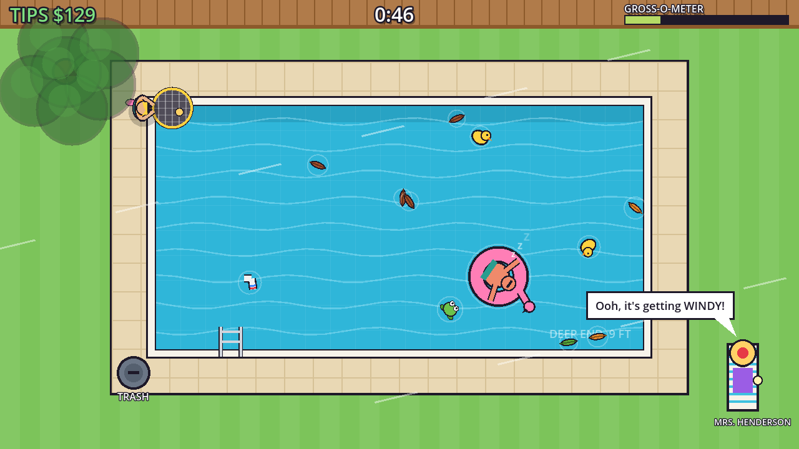

# Pool Boy

A silly top-down arcade game. You're the Pool Boy, walking the deck of Mrs. Henderson's
backyard pool with a very long net. Leaves fall off the tree, the neighbor's kid lobs junk
over the fence (socks, pizza, a toupee, somebody's phone), frogs hop in, and Uncle Dale
naps on a flamingo floatie. Skim it all out before the Gross-o-meter maxes out and you're
fired.



## Running it

1. Install **Godot 4.4+** (standard build, not .NET): https://godotengine.org/download
2. Godot Project Manager → **Import** → pick `pool-boy/project.godot`.
3. Press **F5**.

No asset files are needed. All art is drawn in code and all audio (the lounge music loop
and every sound effect) is synthesized at startup.

## Phone version

`web/index.html` is a single-file JavaScript port laid out for portrait phones, with
**tap-to-queue** controls so your thumb never covers the junk:

- Tap near a piece of junk to queue it. Taps snap to the closest item, and you can queue up
  to 3, shown as numbered markers. Tap a queued item again to cancel it.
- Pool Boy works through the queue on his own, and walks to the trash when his net is full.
- Tap the deck or the trash can to walk there right away (for example, to dump early).
- He never reaches through Uncle Dale. He waits for Dale to drift off, and gives up on an
  item after 2.5 seconds.

It's drawn in a 16-bit suburban-RPG pixel style (EarthBound-inspired, with all original art):
the game renders into a 240x427 pixel buffer that's scaled up crisply, with hand-made sprites
and a built-in bitmap font. The UI is retro-RPG style too: black bordered windows, a rolling
tips odometer, typewriter dialog, and swirling title and results backgrounds.

Arrow keys and Space work on desktop. Add `#autoplay` to the URL to watch the bot play. Like the Rhythm
Chiropractor web build, it's written as an HTML fragment for publishing as a Claude
artifact.

The Godot project is the main version. Gameplay changes need to be made in both places.

## Controls

| Action | Keyboard | Gamepad |
| --- | --- | --- |
| Walk | WASD or arrow keys | Left stick / D-pad |
| Reach with the net (hold) | Space, J, Z, left mouse | A or right trigger |
| Back to title | Esc | |

The net always points into the pool from wherever you stand, so you only ever think
about *where to stand* and *how far to reach*.

## Rules

- **Shift:** 2 minutes. Junk arrives faster as the shift goes on.
- **Net:** holds 5 items. Walk to the **trash can** (bottom-left corner) to dump it.
  Dumping a full net earns a $5 bonus.
- **Tips:** each item pays its own amount, from $1 for a leaf to $8 for a phone.
  Frogs don't take up net space and pay $10.
- **Uncle Dale:** don't poke him. It costs $5 and stuns you for a moment.
- **Gross-o-meter:** every floating item adds to it. If it stays maxed for 4 seconds,
  you're fired.
- **Wind gusts:** these blow everything around and shake extra leaves off the tree.

## Project layout

```
project.godot         Engine config + input map
scenes/               One-node scenes; everything is built in code
scripts/
  game.gd             The shift: movement, net, spawning, wind, Gross-o-meter, results
  debris.gd           Everything that floats (add new junk in KINDS + _draw)
  pool_boy.gd         The hero and his net (visual only)
  yard.gd             Backyard, water, ripples, tree, Mrs. Henderson
  layout.gd           Where everything is (pool, deck, trash can, tree)
  synth.gd            Procedural music + sound effects
  title.gd, ui.gd, save.gd
```

### Tuning

Balance values sit at the top of `scripts/game.gd` (`SHIFT_LENGTH`, `CAPACITY`,
`GROSS_MAX`, `MAX_REACH`...). Per-item tips and grossness are in `Debris.KINDS`.

Test balance without playing. A bot plays a full shift and prints the result:

```
godot --headless --path pool-boy res://scenes/game.tscn -- --autoplay --report
```

The current tuning: the bot survives every shift with $180 to $230 in tips (rank "Pool
Legend" starts at $150), and doing nothing gets you fired in about 45 seconds. The bot
plays better than a first-time human, so expect real players to land around the $60 to
$150 ranks.

## Honest status and what's next

This is a playable prototype, not a game yet. The biggest risks, in order:

1. **The core loop is thin.** Walk, reach, dump, repeat is fine for one shift and
   repetitive by the third. Add variety per shift rather than more junk types.
   For example: a different pool shape each day, a pool party with cannonballing
   guests, a raccoon that steals from your trash can, upgrades between shifts
   (bigger net, longer pole, a robot skimmer).
2. **It's a small game, so price and scope it like one.** A $3 to $5 Steam game with
   3 to 5 days of content is realistic. Don't plan a 20-hour game.
3. **Playtest before adding content.** Watch 5 people play. If they don't laugh at
   Dale or the toupee, the humor needs work before the content does.

For Steam release steps, the checklist at [`../docs/STEAM.md`](../docs/STEAM.md) applies
to this game too.
